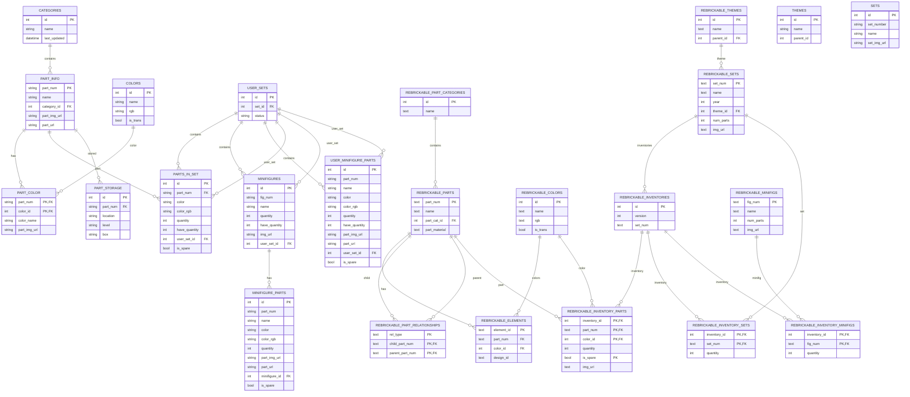

# Brick Manager Database ER Diagram

```mermaid
erDiagram
    CATEGORIES ||--o{ PART_INFO : contains
    PART_INFO ||--o{ PART_COLOR : has
    COLORS ||--o{ PART_COLOR : color
    USER_SETS ||--o{ PARTS_IN_SET : contains
    PART_INFO ||--o{ PARTS_IN_SET : part
    USER_SETS ||--o{ MINIFIGURES : contains
    MINIFIGURES ||--o{ MINIFIGURE_PARTS : has
    USER_SETS ||--o{ USER_MINIFIGURE_PARTS : contains
    PART_INFO ||--o{ PART_STORAGE : stored
    USER_SETS ||--o{ PARTS_IN_SET : user_set
    USER_SETS ||--o{ MINIFIGURES : user_set
    USER_SETS ||--o{ USER_MINIFIGURE_PARTS : user_set

    REBRICKABLE_PART_CATEGORIES ||--o{ REBRICKABLE_PARTS : contains
    REBRICKABLE_COLORS ||--o{ REBRICKABLE_ELEMENTS : colors
    REBRICKABLE_PARTS ||--o{ REBRICKABLE_ELEMENTS : has
    REBRICKABLE_PARTS ||--o{ REBRICKABLE_PART_RELATIONSHIPS : child
    REBRICKABLE_PARTS ||--o{ REBRICKABLE_PART_RELATIONSHIPS : parent
    REBRICKABLE_THEMES ||--o{ REBRICKABLE_SETS : theme
    REBRICKABLE_SETS ||--o{ REBRICKABLE_INVENTORIES : inventories
    REBRICKABLE_INVENTORIES ||--o{ REBRICKABLE_INVENTORY_PARTS : inventory
    REBRICKABLE_PARTS ||--o{ REBRICKABLE_INVENTORY_PARTS : part
    REBRICKABLE_COLORS ||--o{ REBRICKABLE_INVENTORY_PARTS : color
    REBRICKABLE_INVENTORIES ||--o{ REBRICKABLE_INVENTORY_SETS : inventory
    REBRICKABLE_SETS ||--o{ REBRICKABLE_INVENTORY_SETS : set
    REBRICKABLE_INVENTORIES ||--o{ REBRICKABLE_INVENTORY_MINIFIGS : inventory
    REBRICKABLE_MINIFIGS ||--o{ REBRICKABLE_INVENTORY_MINIFIGS : minifig

    CATEGORIES {
        int id PK
        string name
        datetime last_updated
    }
    PART_INFO {
        string part_num PK
        string name
        int category_id FK
        string part_img_url
        string part_url
    }
    PART_COLOR {
        string part_num PK, FK
        int color_id PK, FK
        string color_name
        string part_img_url
    }
    COLORS {
        int id PK
        string name
        string rgb
        bool is_trans
    }
    THEMES {
        int id PK
        string name
        int parent_id
    }
    PARTS_IN_SET {
        int id PK
        string part_num FK
        string color
        string color_rgb
        int quantity
        int have_quantity
        int user_set_id FK
        bool is_spare
    }
    USER_SETS {
        int id PK
        int set_id FK
        string status
    }
    SETS {
        int id PK
        string set_number
        string name
        string set_img_url
    }
    MINIFIGURES {
        int id PK
        string fig_num
        string name
        int quantity
        int have_quantity
        string img_url
        int user_set_id FK
    }
    MINIFIGURE_PARTS {
        int id PK
        string part_num
        string name
        string color
        string color_rgb
        int quantity
        string part_img_url
        string part_url
        int minifigure_id FK
        bool is_spare
    }
    USER_MINIFIGURE_PARTS {
        int id PK
        string part_num
        string name
        string color
        string color_rgb
        int quantity
        int have_quantity
        string part_img_url
        string part_url
        int user_set_id FK
        bool is_spare
    }
    PART_STORAGE {
        int id PK
        string part_num FK
        string location
        string level
        string box
    }

    REBRICKABLE_PART_CATEGORIES {
        int id PK
        text name
    }
    REBRICKABLE_COLORS {
        int id PK
        text name
        text rgb
        bool is_trans
    }
    REBRICKABLE_PARTS {
        text part_num PK
        text name
        int part_cat_id FK
        text part_material
    }
    REBRICKABLE_PART_RELATIONSHIPS {
        text rel_type PK
        text child_part_num PK, FK
        text parent_part_num PK, FK
    }
    REBRICKABLE_ELEMENTS {
        text element_id PK
        text part_num FK
        int color_id FK
        text design_id
    }
    REBRICKABLE_THEMES {
        int id PK
        text name
        int parent_id FK
    }
    REBRICKABLE_SETS {
        text set_num PK
        text name
        int year
        int theme_id FK
        int num_parts
        text img_url
    }
    REBRICKABLE_MINIFIGS {
        text fig_num PK
        text name
        int num_parts
        text img_url
    }
    REBRICKABLE_INVENTORIES {
        int id PK
        int version
        text set_num
    }
    REBRICKABLE_INVENTORY_PARTS {
        int inventory_id PK, FK
        text part_num PK, FK
        int color_id PK, FK
        int quantity
        bool is_spare PK
        text img_url
    }
    REBRICKABLE_INVENTORY_SETS {
        int inventory_id PK, FK
        text set_num PK, FK
        int quantity
    }
    REBRICKABLE_INVENTORY_MINIFIGS {
        int inventory_id PK, FK
        text fig_num PK, FK
        int quantity
    }
```
