# Bricks Manager Database Schema

This document provides a comprehensive overview of the Bricks Manager database schema, including all tables, relationships, and their purposes.

## Database Structure Overview

The Bricks Manager application uses SQLAlchemy ORM with a SQLite database to manage brick sets, parts, storage, and Rebrickable data integration. The database consists of two main sections:

1. **User Management Tables** - For managing user's brick collection
2. **Rebrickable Integration Tables** - For storing reference data from Rebrickable API

## Entity Relationship Diagram

```mermaid
erDiagram
    %% User Management Tables
    sets {
        int id PK
        string set_number
        string name
        string set_img_url
    }
    
    user_sets {
        int id PK
        int set_id FK
        string status
    }
    
    part_info {
        string part_num PK
        string name
        int category_id FK
        string part_img_url
        string part_url
    }
    
    part_color {
        string part_num PK
        int color_id PK
        string color_name
        string part_img_url
    }
    
    parts_in_set {
        int id PK
        string part_num FK
        string color
        string color_rgb
        int quantity
        int have_quantity
        int user_set_id FK
        boolean is_spare
    }
    
    minifigures {
        int id PK
        string fig_num
        string name
        int quantity
        int have_quantity
        string img_url
        int user_set_id FK
    }
    
    minifigure_parts {
        int id PK
        string part_num
        string name
        string color
        string color_rgb
        int quantity
        string part_img_url
        string part_url
        int minifigure_id FK
        boolean is_spare
    }
    
    user_minifigure_parts {
        int id PK
        string part_num
        string name
        string color
        string color_rgb
        int quantity
        int have_quantity
        string part_img_url
        string part_url
        int user_set_id FK
        boolean is_spare
    }
    
    part_storage {
        int id PK
        string part_num FK
        string location
        string level
        string box
    }
    
    %% Rebrickable Integration Tables
    rebrickable_part_categories {
        int id PK
        string name
    }
    
    rebrickable_colors {
        int id PK
        string name
        string rgb
        boolean is_trans
    }
    
    rebrickable_parts {
        string part_num PK
        string name
        int part_cat_id FK
        string part_material
    }
    
    rebrickable_part_relationships {
        string rel_type PK
        string child_part_num PK,FK
        string parent_part_num PK,FK
    }
    
    rebrickable_elements {
        string element_id PK
        string part_num FK
        int color_id FK
        string design_id
    }
    
    rebrickable_themes {
        int id PK
        string name
        int parent_id FK
    }
    
    rebrickable_sets {
        string set_num PK
        string name
        int year
        int theme_id FK
        int num_parts
        string img_url
    }
    
    rebrickable_minifigs {
        string fig_num PK
        string name
        int num_parts
        string img_url
    }
    
    rebrickable_inventories {
        int id PK
        int version
        string set_num
    }
    
    rebrickable_inventory_parts {
        int inventory_id PK,FK
        string part_num PK,FK
        int color_id PK,FK
        int quantity
        boolean is_spare PK
        string img_url
    }
    
    rebrickable_inventory_sets {
        int inventory_id PK,FK
        string set_num PK,FK
        int quantity
    }
    
    rebrickable_inventory_minifigs {
        int inventory_id PK,FK
        string fig_num PK,FK
        int quantity
    }
    
    %% User Management Relationships
    sets ||--o{ user_sets : "has"
    user_sets ||--o{ parts_in_set : "contains"
    user_sets ||--o{ minifigures : "includes"
    user_sets ||--o{ user_minifigure_parts : "tracks"
    part_info ||--o{ parts_in_set : "specified_in"
    part_info ||--o{ part_storage : "stored_in"
    rebrickable_part_categories ||--o{ part_info : "categorizes"
    minifigures ||--o{ minifigure_parts : "composed_of"
    
    %% Rebrickable Integration Relationships
    rebrickable_part_categories ||--o{ rebrickable_parts : "categorizes"
    rebrickable_themes ||--o{ rebrickable_sets : "belongs_to"
    rebrickable_themes ||--o{ rebrickable_themes : "parent_of"
    rebrickable_parts ||--o{ rebrickable_part_relationships : "child"
    rebrickable_parts ||--o{ rebrickable_part_relationships : "parent"
    rebrickable_parts ||--o{ rebrickable_elements : "has_element"
    rebrickable_colors ||--o{ rebrickable_elements : "colored_as"
    rebrickable_inventories ||--o{ rebrickable_inventory_parts : "lists"
    rebrickable_inventories ||--o{ rebrickable_inventory_sets : "contains_sets"
    rebrickable_inventories ||--o{ rebrickable_inventory_minifigs : "contains_minifigs"
    rebrickable_parts ||--o{ rebrickable_inventory_parts : "listed_in"
    rebrickable_colors ||--o{ rebrickable_inventory_parts : "colored_as"
    rebrickable_sets ||--o{ rebrickable_inventory_sets : "inventoried"
    rebrickable_minifigs ||--o{ rebrickable_inventory_minifigs : "inventoried"
```

## Table Descriptions

### User Management Tables

#### `sets`
Template sets that define the basic set information (set number, name, image).

#### `user_sets`
Represents a user's individual collection of sets with status tracking.

#### `part_info`
Core part information including part numbers, names, and metadata.

#### `part_color`
Stores part-color combinations with composite primary key for unique part-color pairs.

#### `parts_in_set`
Junction table linking parts to user sets with quantity tracking and ownership status.

#### `minifigures`
Minifigures contained within user sets with quantity tracking.

#### `minifigure_parts`
Individual parts that make up minifigures.

#### `user_minifigure_parts`
User-specific tracking of minifigure parts with ownership quantities.

#### `part_storage`
Physical storage location information for parts (location, level, box).

### Rebrickable Integration Tables

#### `rebrickable_part_categories`
Reference data for part categories from Rebrickable.

#### `rebrickable_colors`
Color definitions from Rebrickable including RGB values and transparency flags.

#### `rebrickable_parts`
Complete part catalog from Rebrickable with materials and categories.

#### `rebrickable_part_relationships`
Defines relationships between parts (alternate, mold variations, etc.).

#### `rebrickable_elements`
Maps Rebrickable elements to parts and colors.

#### `rebrickable_themes`
Hierarchical theme structure from Rebrickable.

#### `rebrickable_sets`
Complete set catalog from Rebrickable.

#### `rebrickable_minifigs`
Minifigure definitions from Rebrickable.

#### `rebrickable_inventories`
Set inventories linking sets to their contents.

#### `rebrickable_inventory_parts`
Parts contained in specific set inventories.

#### `rebrickable_inventory_sets`
Sub-sets contained within other sets.

#### `rebrickable_inventory_minifigs`
Minifigures contained in specific set inventories.

## Key Features

1. **Hierarchical Data Structure**: The schema supports complex relationships between sets, parts, and minifigures.

2. **Quantity Tracking**: Multiple quantity fields track required vs. owned quantities for parts and minifigures.

3. **Flexible Storage System**: Physical storage tracking with location, level, and box organization.

4. **Rebrickable Integration**: Complete integration with Rebrickable's data structure for comprehensive brick data.

5. **Color Management**: Sophisticated color handling through both user tables and Rebrickable reference data.

6. **Composite Keys**: Strategic use of composite primary keys for junction tables to ensure data integrity.

## Database Indexes and Performance Considerations

The schema is designed with the following performance considerations:

- Primary keys on all major entities
- Foreign key relationships for referential integrity
- Strategic use of composite keys for many-to-many relationships
- Lazy loading configurations in SQLAlchemy relationships

## Migration Support

The application uses Alembic for database migrations, allowing for schema evolution and version control of database changes.